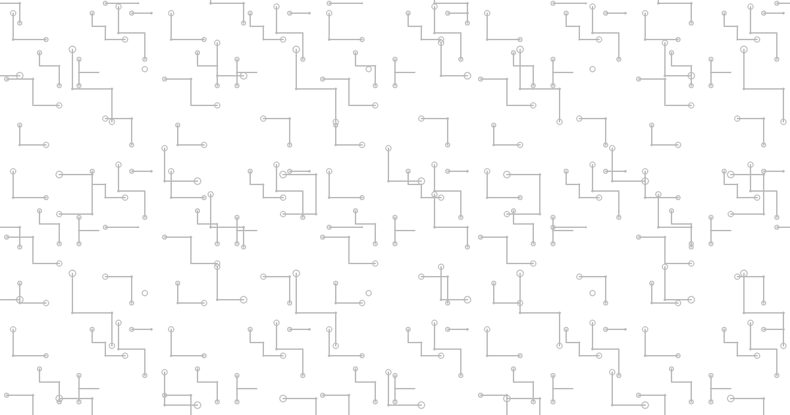

+++
title = 'Markdown Style Test'
date = 2026-09-06T00:00:00
draft = false
description = 'A reference page exercising every Markdown feature base.css styles, for visually checking the theme after changes.'
tags = ['meta']
+++

This page exists purely to eyeball every Markdown construct against the theme in one place. Nothing here is meant to be read for content — jump straight to [Tables](#tables) or [Images](#images) if that's what you're checking.

## Headings

# H1 (for reference — post titles render this way)
## H2
### H3
#### H4
##### H5
###### H6

## Emphasis

Plain text, **bold**, *italic*, ***bold italic***, ~~strikethrough~~, and `inline code`.

## Links

An [inline link](https://gohugo.io "Hugo's homepage"), a [reference-style link][hugo-ref], a bare autolink <https://gohugo.io>, and a linkified bare URL: https://gohugo.io.

[hugo-ref]: https://gohugo.io "Hugo, via reference"

## Lists

### Unordered, with nesting

- Item one
- Item two
  - Nested item
    - Deeper nested item
- Item three

### Ordered, with nesting

1. First
2. Second
   1. Nested first
   2. Nested second
3. Third

### Task list

- [x] Finished task
- [ ] Unfinished task

## Blockquotes

> A simple blockquote.
>
> > A nested blockquote, one level deeper.

## Code

Inline code: `const value = 42;`

Fenced, with a language (syntax highlighting):

```go
func main() {
    fmt.Println("Hello, Ψray!")
}
```

Fenced, no language:

```
plain preformatted text
no highlighting applied
```

## Horizontal rule

---

## Tables

| Left | Center | Right |
|:-----|:------:|------:|
| a    | b      | c     |
| 1    | 2      | 3     |

## Images

A plain Markdown image:



The same image via Hugo's `figure` shortcode, with a caption:



## Footnotes

Here's a sentence that needs a citation.[^1] Here's another, reusing nothing.[^2]

[^1]: The first footnote's text.
[^2]: The second footnote's text, which can run to multiple sentences. Like this one.

## Definition list

Term One
: Its definition.

Term Two
: First definition.
: A second definition for the same term.
